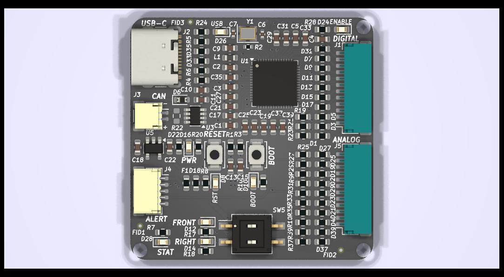
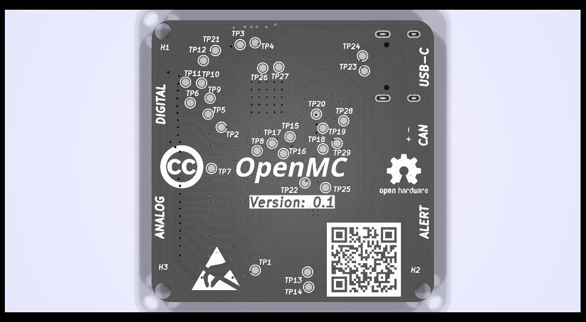

# OpenMC

OpenMC is an Open Source motor controller which serves as an interface between digital inputs and a motor driver interface

OpenMC is designed to be an affordable, flexible, scalable, and open solution to controller small scale electric vehicles (eBikes, Electric Scooters, eSk8, etc).

OpenMC is inspired by projects like [VESC](https://vesc-project.com/)

## Authors

[Orion Serup](mailto:oserup@proton.me)

## License

OpenMC is licensed under the [Creative Commons Share-Alike License](https://creativecommons.org/licenses/by-sa/4.0/)

All derivatives of this work must contain attribution to the original author as well as the same or similar license

This project can be used in any application without restriction (including commercial) provided that proper attribution and licensing terms are met

## Getting Started

Manufacturing files and compiled documentation can be directly downloaded through the releases tab by version.

If you want to modify the source or compile the documentation you will need the following dependencies

### Dependencies

OpenMC is designed using [KiCad](https://kicad.org) Version 8

The documentation is generated using [Typst](https://typst.app)

Version control and configuration management is done by Git and hosted on GitHub

### Downloading the Repository

The files can be downloaded from git, using the Github CLI, Github Desktop (or other visual Git tool) or directly from Github

[Repository Link](https://github.com/orionserup/OpenMC)

Download the repository by going to the GitHub and click on the Code button and select a method of download

## Building the Board

If you downloaded the source files you will have to generate manufacturing files of your own if you would like to build the board based on your local version. Reference KiCad manufacturing file export guides online for the process

Otherwise the generated manufacturing files can be used to build and assemble the board at just about any PCBA manufacturer

### Manufacturing the PCB

Submit the Gerber Files with drill files in zip form (Gerbers.zip if getting from releases) to your manufacturer of choice ([JLCPCB](https://jlcpcb.com) or [PCBWay](https://pcbway.com) is recommended)

The build parameters that are recommended are as follows, these settings will most likely yield the cheapest board with the fastest turn around time

- 1.6mm PCB Height (Not important but 1.6mm is standard)
- 2 Layer PCB
- 1 oz/ft^2 Copper Thickness (Can go down to .5 Oz/ft^2)
- HASL Surface Finish (Lead Free if you want but Leaded is fine)
- Green PCB Color (Official Build use Black but Green is Cheaper and Faster)
- White Silkscreen
- Tented Vias (Untented is also fine)
- No gold fingers, castellated holes, or edge plating

Any other parameters are likely not important and can be ignored

### Sourcing Parts

It is usually possible to have the PCB manufacturer source and purchase parts which are then assembled by them, we recommend doing this if you do not have the proper equipment to solder SMD components. Inquire with your manufacturer of choice to do this

